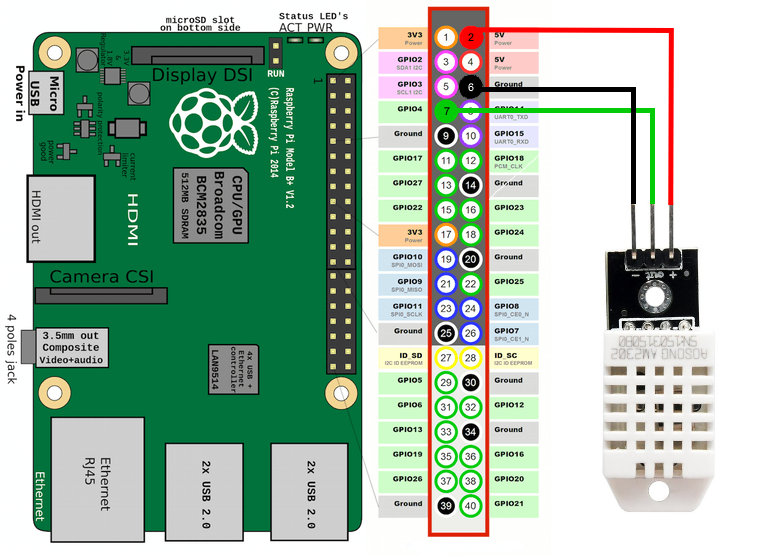

# Raspberry Pi Sensor to ThingsBoard using Constrained Application Protocol <!-- omit in toc -->

## Table of Contents <!-- omit in toc -->
- [Introduction](#introduction)
- [Installation](#installation)
  - [Connecting the sensor](#connecting-the-sensor)
  - [Downloading the script](#downloading-the-script)
- [Usage](#usage)
  
## Introduction

This script is designed to be run on Raspberry Pi 3 Model B hardware running the Raspbian 9.6 operating system. It is also assumed that a DHT22 temperature and humidity sensor is connected to the Raspberry Pi (RPi) using GPIO 4 pin. The process of connecting the sensor is described [here](#connecting-the-sensor).

The script creates a Constrained Application Protocol (CoAP) client on the RPi and repeatedly polls the attached DHT22 sensor for temperature and humidity data. This data is then formatted to JavaScript Object Notation (JSON) and is sent to a CoAP endpoint provided by the ThingsBoard Cloud Platform. This data is then displayed on the ThingsBoard dashboard that shows the current temperature and humidity as well as historical readings in a graph form.

## Installation

### Connecting the sensor



To connect the DHT22 sensor to the RPi:

  1. Connect the - output on the sensor the pin 6 on the RPi.
  2. Connect the + input on the sensor to pin 2 on the RPi.
  3. Connect the 'output' pin on the sensor to pin 7 on the RPi.

### Downloading the script

```bash
$ git clone https://github.com/Silver292/rpi-coap.git
$ cd rpi-coap/
```

## Usage

TODO: